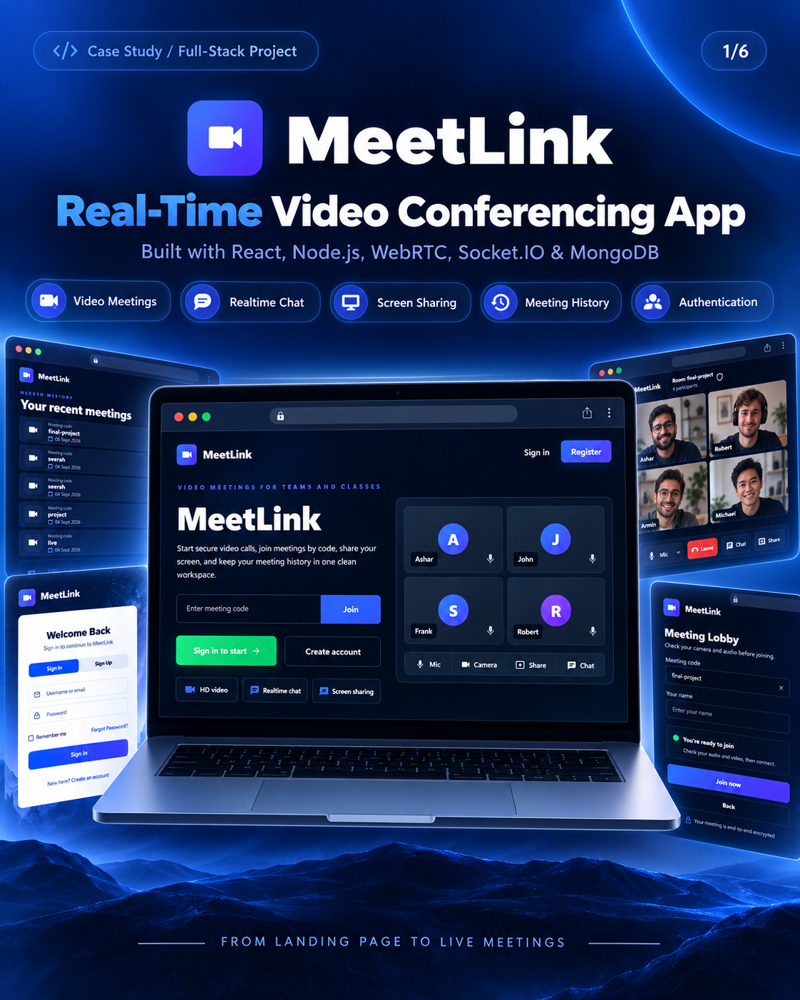
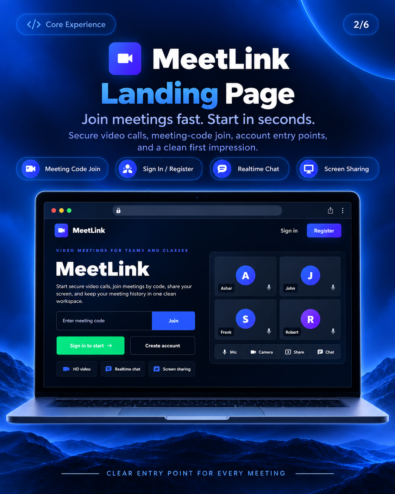
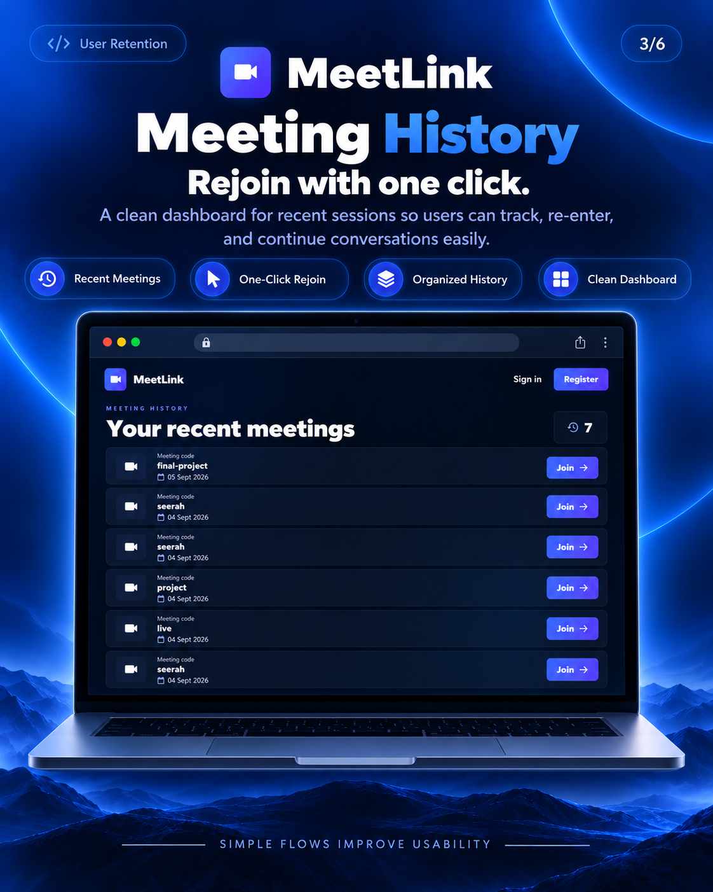
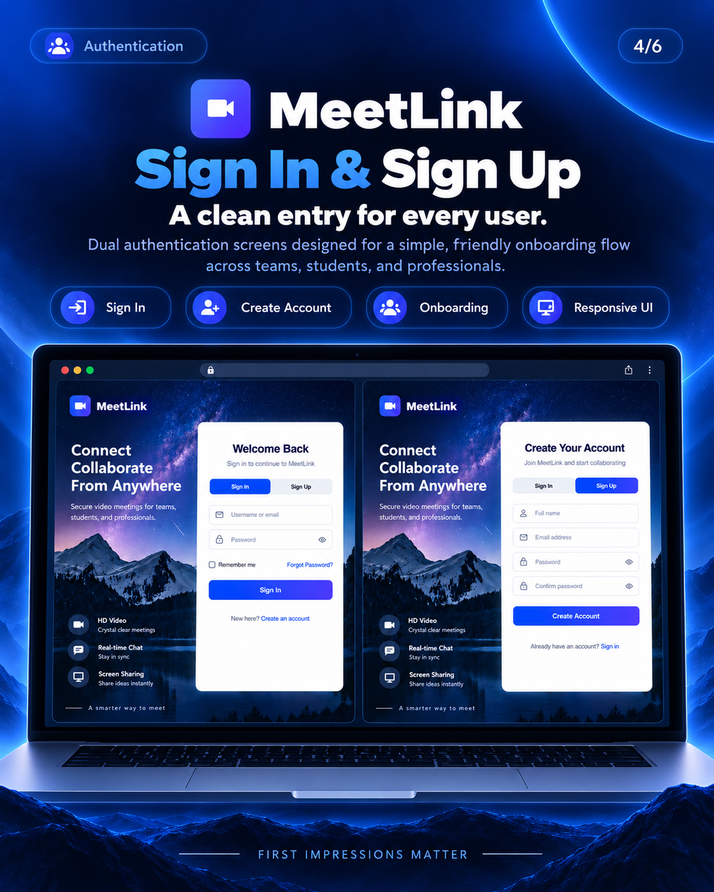
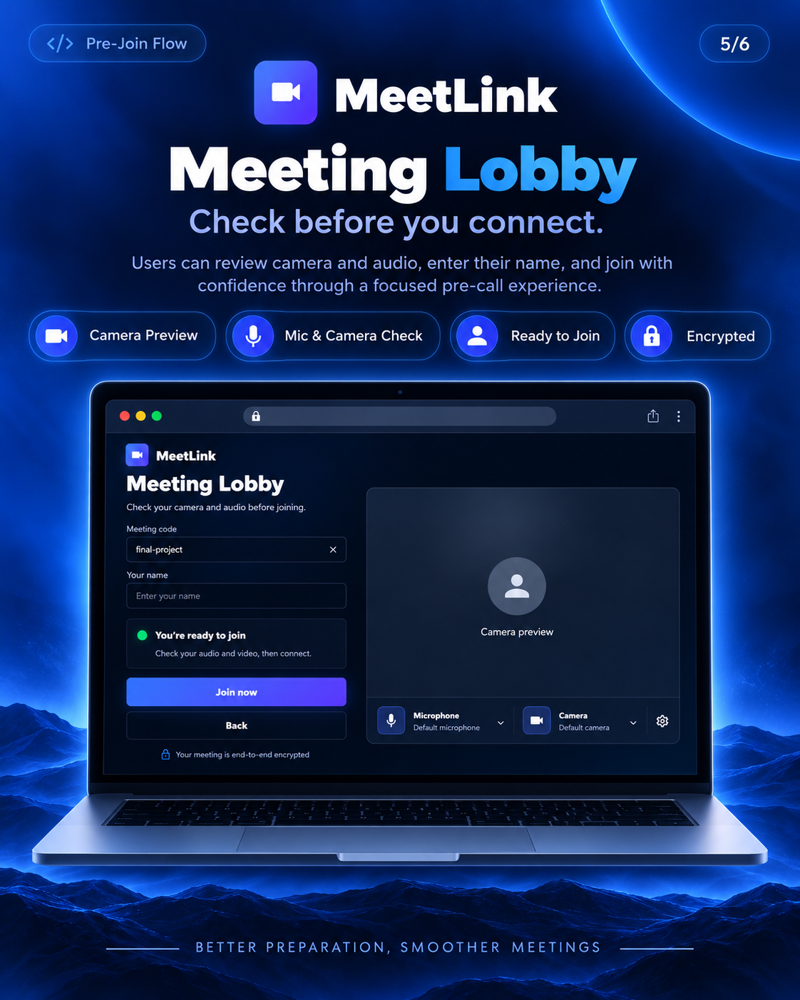
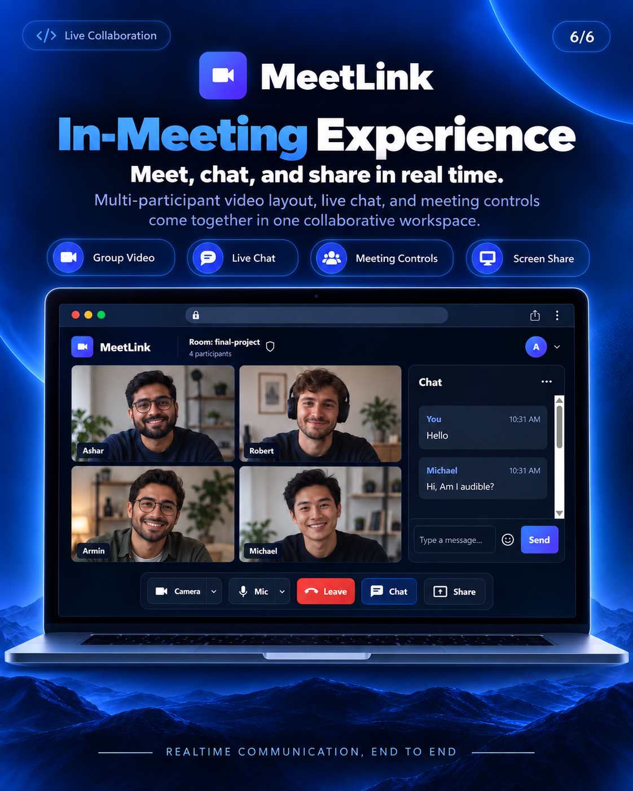

# MeetLink

MeetLink is a full-stack real-time video meeting application built with React, Node.js, Express, Socket.IO, MongoDB, and WebRTC. It allows users to create or join meetings by code, preview their camera before joining, chat during meetings, switch audio/video devices, and use a responsive meeting room UI across desktop, tablet, and mobile.

## Live Demo

Frontend: https://apna-zoom-frontend-wzqw.onrender.com/

## Project Overview

MeetLink started as a Zoom-style video conferencing project and was redesigned into a cleaner, production-style meeting experience. The application now includes a polished landing page, meeting lobby, video meeting room, real-time chat, meeting history, authentication, responsive layouts, and WebRTC connectivity improvements for mobile and desktop users.

## Key Features

- Real-time video meetings using WebRTC
- Socket.IO based signaling server
- Join meetings using a custom meeting code
- Guest meeting flow with name entry
- User authentication with login and registration
- Meeting history for logged-in users
- Camera and microphone permission handling
- Live camera preview before joining
- Actual camera on/off toggle
- Actual microphone mute/unmute toggle
- Camera-off fallback avatar with initials
- Remote camera-off state shown to other participants
- Remote muted microphone state indicator
- Screen sharing support on compatible desktop browsers
- Real-time chat inside meeting rooms
- Chat panel can be opened and closed
- Video layout expands when chat is closed
- Device dropdowns for microphone and camera selection
- Responsive layouts for 2, 3, 4, and many participants
- Mobile-friendly landing, lobby, home, history, and meeting room pages
- Automatic participant removal when user leaves or closes browser
- Graceful fallback when screen sharing is unsupported on mobile/tablet
- TURN/STUN support for more reliable mobile-to-laptop WebRTC connections
- SPA routing support for deployed frontend links

## Case Study

### Problem

Basic WebRTC video meeting apps often work locally but fail across mobile data, different Wi-Fi networks, or deployed environments. They also commonly suffer from poor responsive layout, duplicate video tiles, black video states, chat flickering, and unreliable participant cleanup.

### Solution

MeetLink solves these issues by combining a Socket.IO signaling server with WebRTC peer connections, TURN/STUN support, responsive UI layouts, real media controls, device selection, participant state syncing, and clean disconnect handling.

### Engineering Focus

- Stable WebRTC peer connection handling
- Duplicate stream prevention
- Remote media state synchronization
- Mobile-to-desktop connectivity using TURN
- Responsive meeting room layouts
- Clean UX for camera/mic permissions
- Production deployment compatibility on Render
- Protected history and authentication flows

## Screenshots

### MeetLink



### Landing Page



### Meeting History



### Login & Signup



### Meeting Lobby



### Meeting Room



## Tech Stack

### Frontend

- React
- React Router
- Material UI
- MUI Icons
- Socket.IO Client
- WebRTC APIs
- CSS Modules
- Axios

### Backend

- Node.js
- Express
- Socket.IO
- MongoDB
- Mongoose
- bcrypt
- crypto
- CORS

## Main Pages

### Landing Page

The landing page provides a clean introduction to the app with meeting code entry, authentication actions, and a responsive layout. On mobile, decorative preview elements are hidden so the main actions stay focused and readable.

### Meeting Lobby

After entering a meeting code, users land on the meeting lobby. The lobby lets users:

- Confirm the meeting code
- Enter a display name
- Preview camera
- Allow camera/microphone permissions
- Select microphone device
- Select camera device
- Join the meeting
- Go back

### Meeting Room

The meeting room includes:

- Main video grid
- Participant names
- Camera and microphone controls
- Leave button
- Chat panel
- Screen share button
- More options button
- Responsive video layouts
- Local self-preview for two-person calls
- Full-width video area when chat is hidden

### History Page

Logged-in users can view previous meeting codes they joined. The page is protected against unauthenticated access and displays a clean empty state when no history exists.

## WebRTC and TURN Support

MeetLink uses WebRTC for peer-to-peer audio/video. Socket.IO is used for signaling events such as joining rooms, exchanging SDP offers/answers, ICE candidates, chat messages, media state changes, and disconnect handling.

For better connectivity across different networks, especially mobile data to laptop Wi-Fi, the backend provides a TURN credentials endpoint:

```txt
GET /api/v1/turn-credentials
```

The backend fetches TURN credentials from Metered and returns them to the frontend without exposing the Metered API key in browser code.

If Metered credentials are missing or unavailable, the app falls back to a STUN server.

## Environment Variables

### Frontend

Create a `.env` file inside the `frontend` folder:

```env
REACT_APP_BACKEND_URL=http://localhost:8000
```

For Render frontend deployment:

```env
REACT_APP_BACKEND_URL=https://apnacollegebackend.onrender.com
```

### Backend

On Render backend environment variables:

```env
METERED_APP_NAME=your_metered_app_name
METERED_API_KEY=your_metered_api_key
```

## Local Setup

Clone the repository:

```bash
git clone https://github.com/ashardeveloper/realtime-video-conferencing.git
cd realtime-video-conferencing
```

Install backend dependencies:

```bash
cd Backend
npm install
```

Start backend:

```bash
npm start
```

Backend runs on:

```txt
http://localhost:8000
```

Install frontend dependencies:

```bash
cd ../frontend
npm install
```

Create `frontend/.env`:

```env
REACT_APP_BACKEND_URL=http://localhost:8000
```

Start frontend:

```bash
npm start
```

Frontend runs on:

```txt
http://localhost:3000
```

## Available Scripts

### Frontend

Run the React development server:

```bash
npm start
```

Create a production build:

```bash
npm run build
```

Run the test runner:

```bash
npm test
```

### Backend

Run the backend server:

```bash
npm start
```

Run the backend using nodemon:

```bash
npm run dev
```

## Render Deployment Notes

### Frontend

Root directory:

```txt
frontend
```

Build command:

```bash
npm install && npm run build
```

Publish directory:

```txt
build
```

SPA rewrite rule:

```txt
Source: /*
Destination: /index.html
Action: Rewrite
```

This is required so meeting links like `/conference` open correctly on refresh or direct visit.

### Backend

Root directory:

```txt
Backend
```

Build command:

```bash
npm install
```

Start command:

```bash
npm start
```

Required environment variables:

```env
METERED_APP_NAME=your_metered_app_name
METERED_API_KEY=your_metered_api_key
```

## API Routes

### Auth

```txt
POST /api/v1/users/register
POST /api/v1/users/login
```

### Meeting History

```txt
POST /api/v1/users/add_to_activity
GET /api/v1/users/get_all_activity
```

### TURN Credentials

```txt
GET /api/v1/turn-credentials
```

## Socket Events

The backend uses Socket.IO for real-time meeting communication.

Main events:

- `join-call`
- `user-joined`
- `user-left`
- `signal`
- `chat-message`
- `media-state-change`

## Responsive Design

The app was polished for:

- Desktop screens
- Laptop screens
- Tablet layouts
- Mobile screens
- Short-height screens
- 2 participant calls
- 3 participant calls
- 4 participant calls
- Many participant calls

The video grid adapts based on participant count, and the chat panel can be hidden so videos can use the full available width.

## Important Browser Notes

- Camera and microphone require browser permission.
- On deployed sites, WebRTC works best over HTTPS.
- Screen sharing is mainly supported on desktop browsers.
- Mobile browsers may not support screen sharing, so the app shows a graceful fallback.
- TURN credentials are important for video calls across different networks.

## Future Improvements

- Add private meeting invite links
- Add waiting room approval
- Add recording support
- Add participant list panel
- Add reactions
- Add meeting duration timer
- Add profile settings
- Move all production secrets fully into environment variables
- Add automated tests for auth, history, and socket events

## Author

Built by [Ashar Mahmood](https://github.com/ashardeveloper)
